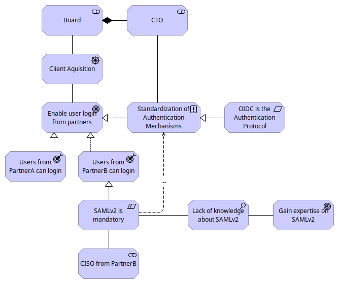
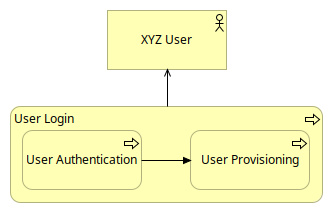
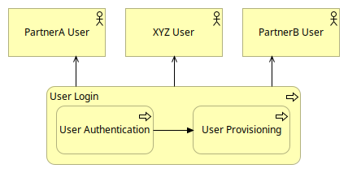
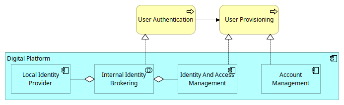
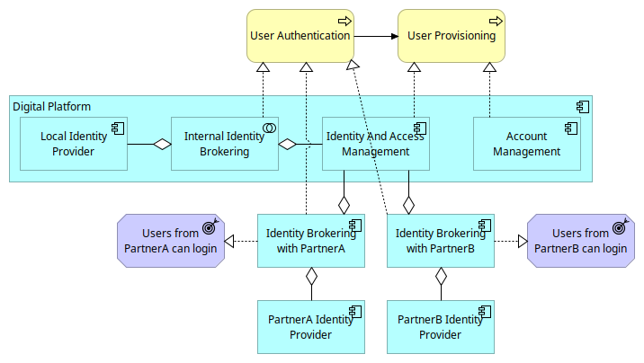
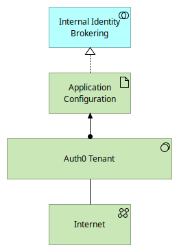
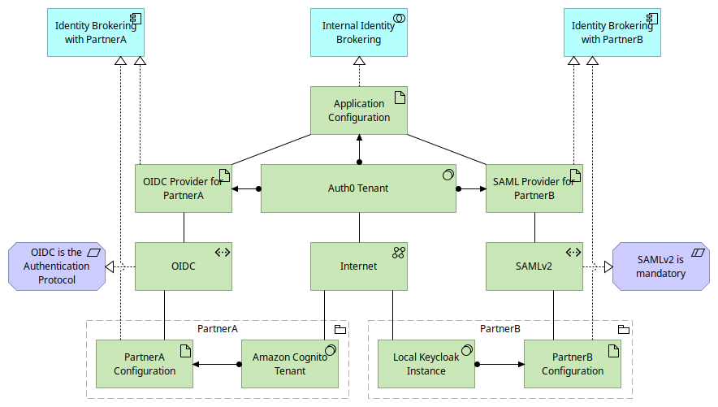
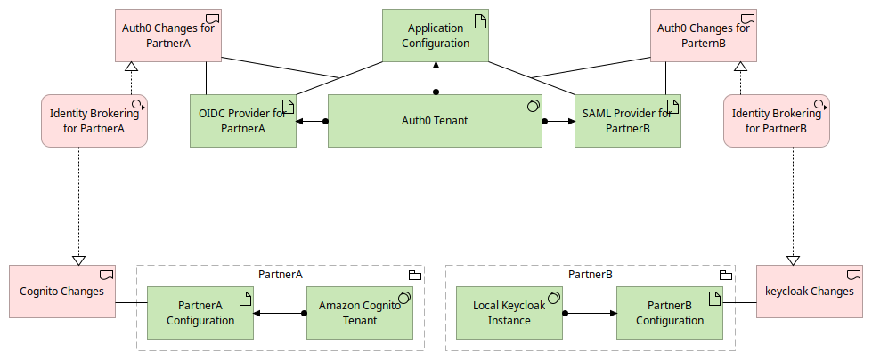
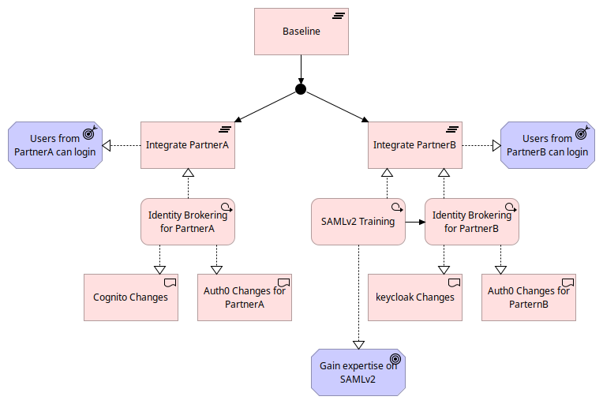

= ArchiMate: A Practical Introduction
:author: Thibault Morin
:revdate: 2023-11-14
:revnumber: 1
:toc:
:icons: font
:source-highlighter: coderay
:doctype: article
:description: The article discusses the practical applications of ArchiMate through a fictive scenario.
:copyright: CC BY 4.0

[abstract]
== Abstract

The article delves into the role of ArchiMate, an enterprise architecture modeling language, in addressing the misalignment between business goals and IT capabilities within organizations. Through a fictive scenario involving XYZ Company, a B2B service provider facing stagnating client acquisition, the article illustrates how ArchiMate aids in the strategic integration of user logins from partner platforms. It explores ArchiMate's application across various layers of enterprise architecture—Motivation, Business, Application, Technology, and Implementation and Migration—demonstrating its utility in mapping out motivations, re-engineering business processes, aligning IT applications, integrating technology infrastructure, and orchestrating actionable implementation plans. The article highlights the importance of understanding and aligning various stakeholder motivations and objectives, adapting business and IT operations to new strategies, and facilitating the integration of new technologies and processes. ArchiMate is presented as more than a modeling tool; it is a critical facilitator of clarity, alignment, and adaptability in enterprise architecture, making it indispensable for effective strategic planning and execution in complex business environments.

== Introduction

In the intricate world of enterprise architecture, complexity is a constant. Businesses evolve, technologies advance, and with these changes, the need to realign business processes and IT infrastructure becomes not just necessary but ineluctable. A common hurdle many organizations face is the misalignment between business goals and IT capabilities. The consequences? Hindered growth, operational inefficiencies, and missed opportunities.

In navigating this labyrinth, a precise and structured tool is essential. This is where ArchiMate <<archimate>>, an open and independent modeling language for enterprise architecture, steps in. ArchiMate doesn't just document the status quo of an organization's architecture; it's a tool for envisaging and planning transformative steps. By providing a clear visual representation, ArchiMate enables organizations to see how changes in one domain, such as business processes, impact IT systems, and vice versa. This clarity is crucial for effective decision-making and strategic planning.

To introduce the practical applications of ArchiMate, let's consider a fictive scenario involving XYZ Company, a B2B service provider with a digital platform. XYZ faces a challenge: their client acquisition isn't scaling as expected. To address this, they initiate a project to integrate user logins from partner platforms, aiming to widen their user base.

However, this initiative isn't straightforward. It involves adapting business processes, aligning them with IT infrastructure, and ensuring that both sides support the company's strategic goals.

It’s important to note that this scenario, while reflective of common business challenges, is a simplified representation. Real-world cases often involve more complex layers, such as information architecture, which we will not delve into here. The aim is to provide a clear, understandable example of how ArchiMate can be applied.

The article will cover dive into the different layers of ArchiMate, applied to the XYZ scenario. From motivation to technology, we’ll explore how each layer contributes to a cohesive enterprise architecture strategy.

== Navigating Motivations in Architecture

As we delve deeper into the world of enterprise architecture with ArchiMate, it becomes evident that understanding the 'why' behind any initiative is as crucial as the 'how' or the 'what'. This brings us to the Motivation layer of ArchiMate, a pivotal aspect that sheds light on the underlying drivers, goals, and aspirations of an architectural project.

Recall our fictive scenario: XYZ Company, a B2B service provider, is grappling with stagnating user acquisition on their digital platform. The board has pinpointed a strategic move - to integrate user logins from partner platforms, starting with PartnerA and PartnerB, as a potential game-changer. But, as is often the case in complex business ecosystems, this decision is not without its challenges and nuances.

The CTO of XYZ, driven by a desire for streamlined processes and security, insists on standardizing authentication mechanisms across the platform, leaning towards the OpenID Connect (OIDC) protocol. PartnerA is on board with this approach. However, the plot thickens as the Chief Information Security Officer (CISO) of PartnerB mandates the use of SAMLv2 for authentication, a protocol less familiar to XYZ's team. This divergence in preferences not only highlights varied motivational factors but also introduces a technical and knowledge gap that XYZ must bridge.

In the accompanying view, we illustrate how these diverse motivations - from the board's concern for user acquisition to the technical preferences of partners - interact and influence the project's direction. This visual representation not only aids in understanding the complexities at play but also serves as a communication tool, aligning various stakeholders on common goals while acknowledging their individual concerns.

.The Motivation View

The resulting ArchiMate view does more than just map out motivations. It provides a foundation for subsequent decisions and strategies. It also highlights the need for XYZ to acquire expertise in SAMLv2, underscoring the importance of continual learning and adaptation in today’s fast-paced business environment.

== Mapping the Business Layer

In our exploration of ArchiMate's application within enterprise architecture, we now turn our focus to the Business layer. This layer is crucial, as it deals with the core operations and processes of an organization. Understanding and modeling this layer effectively can significantly impact how a business adapts to changes and integrates new initiatives.

Recall our ongoing fictive scenario with XYZ Company, a B2B service provider struggling with user acquisition on their digital platform. The company's initiative to integrate user logins from partner platforms presents an opportunity to examine and re-engineer their existing business processes.

Initially, XYZ's user login process is straightforward, consisting of two primary sub-processes: User Authentication and User Provisioning. These processes are designed to cater to XYZ's users efficiently. However, with the new initiative to incorporate logins from PartnerA and PartnerB, the existing business process architecture requires re-evaluation.

The transformation journey begins by expanding the User Login process to accommodate users from PartnerA and PartnerB. This expansion is not just a technical integration but a strategic realignment of business processes to meet new business objectives.

In this article, we present two distinct ArchiMate views:

- Baseline of the Business Architecture: This view illustrates the existing user login process at XYZ, providing a clear understanding of the current state.

.Baseline of the Business Architecture

- Target of the Business Architecture: This view delineates the evolved user login process, including the integration of PartnerA and PartnerB, showcasing the desired future state.

.Target of the Business Architecture

These visualizations serve as blueprints for the transition, enabling stakeholders to grasp the scope of change and plan accordingly.

By implementing these views, we not only visualize the impacted business processes but also pave the way for detailed planning in subsequent architecture layers. This clarity in the business layer is fundamental for ensuring that the changes align with the company’s overall objectives and capabilities.

== Synchronizing Business and IT

Our journey with ArchiMate now takes us to a critical juncture - the Application layer and its interplay with the Business layer. In the realm of enterprise architecture, aligning these two layers is paramount for ensuring that IT systems effectively support business processes and vice versa.

In the scenario of XYZ Company, the initiative to integrate partner logins presents an opportunity to explore how changes in the Business layer necessitate adaptations in the Application layer.

At the outset, XYZ's user login process involves two main applications: the local Identity Provider and the Identity and Access Management system. These applications work in tandem to facilitate the User Authentication and User Provisioning processes.

As XYZ moves to incorporate logins from PartnerA and PartnerB, the Application Architecture must evolve. This evolution involves establishing new collaborations to handle identities from these partners, reflecting changes made in the Business layer.

This article features two ArchiMate views:

- Baseline of the Application Architecture: This view captures the current state of applications involved in the user login process, offering a snapshot of the existing infrastructure.

.Baseline of the Application Architecture

- Target of the Application Architecture: This view illustrates the new collaborations and their integration into the existing architecture, highlighting the evolution toward the desired future state.

.Target of the Application Architecture

These visual representations provide a clear understanding of the changes at the application level and their alignment with business process transformations.

With these views, we not only demonstrate the addition of new collaborations but also affirm that the User Provisioning process remains unaffected by these changes. This alignment ensures that XYZ’s IT systems remain agile and responsive to the evolving business needs.

== Integrating Technology and Applications

As we continue our exploration of ArchiMate within the enterprise architecture landscape, we arrive at a crucial layer: the Technology layer. This layer is where the rubber meets the road, integrating the application's needs with the underlying technological infrastructure. It's where strategic decisions about technology stacks and configurations take shape.

Our ongoing fictive case study with XYZ Company, which is working to integrate partner logins, provides a perfect backdrop to illustrate the nuances of the Technology layer. This initiative necessitates significant changes not only in applications but also in the technological infrastructure that supports these applications.

Initially, XYZ's Identity Brokering collaboration is managed through an Auth0 Tenant, which is a critical component of their infrastructure. This setup serves their current needs adequately, but with the planned integration of PartnerA and PartnerB, this architecture requires a careful re-assessment and likely, an upgrade.

The integration journey involves several key changes:

- For PartnerA, XYZ needs to establish an OIDC protocol-based connection, involving the creation of an OIDC Provider within their Auth0 Tenant and expects adjustments in the Amazon Cognito Tenant by PartnerA.

- For PartnerB, the integration is more complex, necessitating the adoption of the SAMLv2 protocol. This introduces new elements into the architecture, including a SAML Provider in the Auth0 Tenant and expects modifications in the Local Keycloak Instance by PartnerB.

In this article, we present two distinct views:

Baseline of the Technology Architecture: This view outlines the current state of XYZ’s technology infrastructure, focusing on the Auth0 Tenant and its role.

.Baseline of the Technology Architecture

- Target of the Technology Architecture: This view illustrates the future state post-integration, showcasing the new configurations and protocol adoptions needed to support the business initiative.

.Target of the Technology Architecture

These visualizations are critical in understanding the technological implications of the business decisions and ensuring that the technology architecture remains robust and scalable.

By implementing these views, we not only depict the necessary technological changes but also ensure adherence to key requirements, like the OIDC and SAMLv2 protocols. This comprehensive approach guarantees that XYZ's technology layer supports and enhances its application and business layers.

== Orchestrating Changes

As we near the conclusion of our ArchiMate journey, we focus on a critical aspect often overlooked in enterprise architecture: the Implementation and Migration layer. This layer is where strategic plans transform into actionable steps, where the rubber meets the road in bringing architectural visions to life.

Our ongoing case study with XYZ Company, which has been navigating the integration of partner logins, offers a practical lens through which to view the intricacies of this layer. The challenge now is to translate the previously outlined business, application, and technology changes into a structured, executable plan.

Key to this transition are the work packages – distinct sets of tasks and deliverables that are essential for the integration. For XYZ, these are divided into two main categories:

- PartnerA Integration Work Package: This encompasses all tasks related to the integration of PartnerA, adhering to the OIDC protocol.

- PartnerB Integration Work Package: This includes all the steps necessary for PartnerB’s integration, focusing on the SAMLv2 protocol and the additional training required for XYZ's team.

In this article, we present two views:

- Identified Work Packages: This view categorizes and outlines the specific tasks and deliverables for each partner integration, providing clarity and structure.

.The Identified Work Packages View

- The Overall Plan: This view offers a roadmap for the implementation, highlighting timelines, dependencies, and key milestones.

.The Overall Plan View

These views are pivotal in ensuring that all stakeholders have a clear understanding of the what, when, and how of the project's implementation phase.

Implementing these views allows XYZ to not only organize the workload into manageable segments but also to identify potential risks and dependencies early. This proactive planning is crucial in ensuring a smooth transition and successful implementation.

== Conclusion

As we wrap up our article on ArchiMate, it's time to reflect on the insights gained and the journey undertaken. Throughout this article, using the scenario of XYZ Company, we've explored how ArchiMate facilitates the understanding and execution of complex enterprise architecture initiatives, from the conceptualization of ideas to their practical implementation.

XYZ's journey, a fictive but representative scenario, illustrated the challenges and solutions at each layer of enterprise architecture:

- Motivation Layer: We saw how ArchiMate helped in aligning stakeholder motivations and objectives.

- Business Layer: This layer highlighted the adaptation of business processes to new strategic goals.

- Application Layer: We explored the alignment of IT applications with evolving business needs.

- Technology Layer: This phase emphasized the integration of technology infrastructure with application changes.

- Implementation and Migration Layer: Finally, we looked at turning strategic plans into actionable work packages and a comprehensive implementation roadmap.

This series introduced that ArchiMate is more than just a modeling tool; it's a communication facilitator, a problem solver, and a strategic enabler. It allows for:

- Clarity: Offering clear visualizations of complex structures and relationships.

- Alignment: Ensuring business goals and IT capabilities are in harmony.

- Adaptability: Facilitating the smooth integration of new processes and technologies.

The journey with XYZ Company, though hypothetical, is reflective of the real challenges faced in many organizations. The question remains: How can we apply these insights to our real-world scenarios? Whether you're dealing with a small-scale project or a large-scale transformation, the principles and practices discussed here are universally applicable.

[bibliography]
== Bibliography

* [[[archimate]]] "ArchiMate", The Open Group, https://www.opengroup.org/archimate

[colophon]
== Colophon

Distributed under the https://creativecommons.org/licenses/by/4.0:[{copyright}] license.
